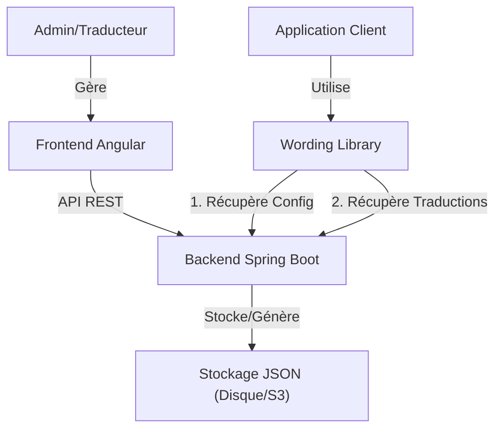

# Architecture du Projet : Plateforme de Gestion de Traductions

## 1. Vue d'ensemble
L'objectif est de fournir une solution centralisée pour gérer les configurations et les fichiers de traduction de la librairie `@indatacore/wording-library` intégrée chez les clients.

### Diagramme de Flux


---

## 2. Backend (Spring Boot)

### Technologies
- **Java 17+**
- **Spring Boot 3.x**
- **Spring Data JPA** (PostgreSQL/MySQL)
- **Lombok**

### Modèle de Données (Entités Simplifiées)
*   **Language**: `code` (fr, en), `name` (Français, Anglais)
*   **Translation**: `key`, `value`, `languageId`, `version`, `isDraft`
*   **VersionConfig**: `languageCode`, `currentVersion` (ex: "2")

### API Endpoints
#### Public (Consommé par la librairie)
*   `GET /api/v1/public/config.json` : Renvoie la configuration globale.
*   `GET /api/v1/public/i18n/{lang}.v{version}.json` : Renvoie le fichier de traduction.

#### Admin (Consommé par le Frontend)
*   `GET /api/v1/translations` : Matrice de traduction.
*   `POST /api/v1/translations` : Sauvegarde (Draft).
*   `POST /api/v1/publish` : Génère les fichiers JSON statiques et incrémente la version.

### Stratégie de Stockage : Système de Fichiers (File System)
Au lieu d'une base de données complexe, nous stockerons les données directement sous forme de fichiers JSON sur le disque du serveur. C'est simple, performant et facile à sauvegarder.

#### Structure des Dossiers
```text
/storage
  ├── config.json           # La configuration globale (versions)
  └── i18n
      ├── fr.v1.json
      ├── fr.v2.json
      ├── en.v1.json
      └── ...
```

#### Implémentation Java (Spring Boot)
Nous utiliserons `java.nio.file` pour lire et écrire.
*   **Service** : `JsonFileStorageService`
*   **Méthodes** :
    *   `saveConfig(ConfigDto config)` : Écrit dans `storage/config.json`.
    *   `saveTranslation(String lang, String version, Map<String, String> content)` : Écrit dans `storage/i18n/{lang}.v{version}.json`.
    *   `readConfig()` : Lit et parse le fichier JSON.

*Avantage* : Les fichiers générés sont directement ceux que la librairie consomme. Pas de conversion nécessaire.

---

## 3. Frontend (Angular)

### Technologies
- **Angular 15+** (Cohérence avec la librairie)
- **Angular Material** ou **PrimeNG** (pour la DataGrid)

### Modules Clés
1.  **Dashboard / TranslationEditor** :
    *   Vue unique combinant configuration et édition.
    *   Tableau éditable : Colonne Clé | Colonne FR | Colonne EN.
    *   Indicateur visuel des modifications "Draft".
    *   Bouton **"Publier Version"** par langue.
2.  **Settings** :
    *   Ajout/Suppression de langues.
    *   Visualisation des versions actuelles (ex: FR: v2, EN: v1).

---

## 4. Intégration Librairie
La librairie existante n'aura besoin que d'un changement de configuration pour pointer vers cette plateforme :

```typescript
// Dans l'application client
WordingLibraryModule.forRoot({
    baseUrl: 'https://api.votre-plateforme.com/api/v1/public',
    // ...
})
```
La librairie reste "bête" : elle ne fait que lire ce que la plateforme lui sert.
